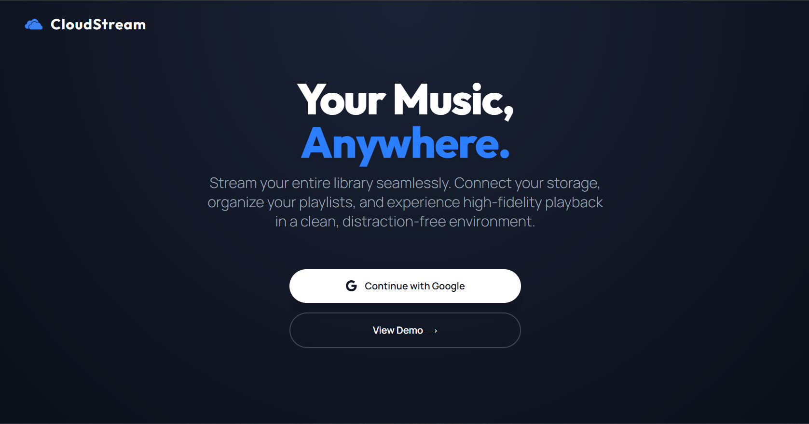
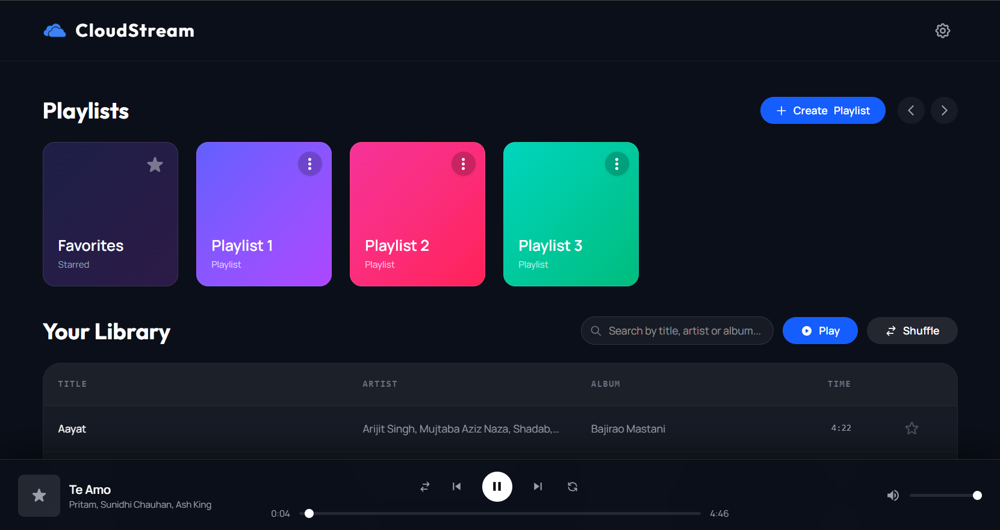
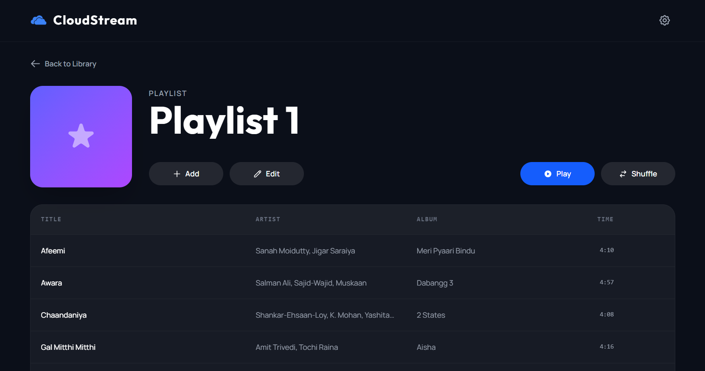

# CloudStream

A Progressive Web App (PWA) that transforms your Google Drive into a personal music streaming platform. CloudStream lets users securely stream, organize, and manage their own music library from any device while delivering a native-like listening experience through intelligent caching, background playback, and offline support.

> **Live Demo:** https://cloudstream-kavan.vercel.app
>
> **Demo Mode:** Want to explore the application without connecting your own Google Drive? Click **View Demo** on the landing page to instantly access a pre-configured demo library and experience the application's features without Google OAuth setup.







## Why CloudStream?

Traditional cloud storage services make it easy to store music, but they do not provide a listening experience comparable to dedicated music streaming applications. Repeatedly scanning large folders, network buffering between tracks, and limited offline support result in a poor user experience.

CloudStream addresses these challenges by using Google Drive as the storage layer while introducing a dedicated backend for metadata management, intelligent synchronization, and a client-side audio engine designed to provide a smooth, native-like listening experience.

## Features

### Music Library

- Stream your personal music library directly from Google Drive.
- Search tracks by **title, artist, or album**.
- Organize music using custom playlists.
- Create, rename and delete playlists.
- Add or remove, or reorder tracks from playlists.
- Automatically extract ID3 metadata including artist, album, and duration.

### Playback Experience

- Gapless playback.
- Background playback support on mobile browsers.
- Native lock screen and hardware media controls.
- Repeat One and Repeat All playback modes.
- Dynamic shuffle playback.

### Offline & Performance

- Cache favorite tracks for offline playback.
- Automatic cache cleanup to efficiently manage local storage.

### Google Drive Integration

- Secure Google OAuth authentication.
- Import music folders using the Google Picker API.
- One-click synchronization with Google Drive.

### Demo Mode

- Explore the application without connecting a personal Google Drive account.
- Instantly access a fully configured demo library with a single click.

## Tech Stack

| Category | Technologies |
|----------|--------------|
| **Frontend** | React, Vite, JavaScript, Tailwind CSS, Axios |
| **Backend** | Node.js, Express.js, Prisma ORM |
| **Database** | PostgreSQL |
| **Authentication** | Google OAuth 2.0 |
| **Google Services** | Google Drive API, Google Picker API |
| **Browser APIs** | HTML5 Audio API, Media Session API, Cache API, Storage API, Service Workers |
| **Deployment** | Vercel (Frontend), Render (Backend) |

## Architecture

CloudStream is designed around a simple principle: **Google Drive should remain the source of truth for music files, while the backend and client work together to deliver a responsive, native-like playback experience.**

Rather than repeatedly scanning Drive or proxying every audio request through the backend, CloudStream separates responsibilities across three layers:

- **Google Drive** stores the original audio files.
- **The backend** manages authentication, metadata persistence, playlist management, and synchronization.
- **The frontend** is responsible for playback, caching, queue management, offline storage, and user interaction.

This architecture minimizes unnecessary network requests, reduces backend load, and allows playback to remain responsive even when interacting with large music libraries.

---

### Direct Google Drive Streaming

Audio files are streamed directly from Google Drive instead of being proxied through the backend.

This approach offers several advantages:

- Eliminates an unnecessary network hop during playback.
- Reduces backend bandwidth usage.
- Improves playback startup time.
- Allows the backend to focus solely on authentication, metadata management, and synchronization.

The backend therefore acts as the application's control plane, while Google Drive serves as the media delivery layer.

---

### Metadata Persistence & Incremental Synchronization

Scanning an entire cloud storage folder every time a user signs in becomes increasingly expensive as libraries grow.

To avoid this, CloudStream performs an initial import that extracts and stores track metadata inside a PostgreSQL database. The database stores information required to render the library without accessing Google Drive on every session, including:

- Drive File ID
- Track title
- Artist
- Album
- Duration
- MIME type
- Favorite status
- User association

As a result, subsequent logins load directly from the database, providing significantly faster startup times regardless of library size.

When the user initiates a synchronization, the backend uses the **Google Drive Changes API** to identify additions, modifications, and deletions without rescanning the entire folder.

To improve resilience, CloudStream also implements a fallback synchronization strategy. If incremental synchronization cannot be completed, for example due to an expired change token, the backend performs a full folder scan, compares Drive File IDs against the database, inserts metadata for newly discovered tracks, and removes entries that no longer exist. This ensures the library remains consistent even when incremental synchronization is unavailable.

---

### Dual-Tier Audio Caching

Maintaining uninterrupted playback while keeping storage usage under control required two complementary caching strategies.

#### Sliding Window Memory Cache

To achieve seamless transitions between songs, CloudStream maintains a speculative in-memory cache around the currently playing track.

Rather than downloading tracks only when requested, the playback engine continuously preloads:

- the next two tracks, and
- the previous two tracks

relative to the active queue position.

These files are downloaded from Google Drive as `Blob` objects and converted into local Object URLs. When playback advances, the audio source is switched immediately to the already-loaded Object URL, eliminating additional network buffering between tracks.

As the listening position changes, Object URLs outside the active window are automatically revoked to prevent unnecessary browser memory consumption.

#### Persistent Offline Cache

Favorite tracks are additionally stored using the browser Cache API.

Whenever a favorite track is played, CloudStream first checks persistent local storage. If a cached copy exists, playback begins immediately without contacting Google Drive. Otherwise, the track is streamed normally and then stored locally for future use.

To prevent uncontrolled storage growth, cached tracks are periodically evaluated using a heuristic based on listening frequency and inactivity. Less relevant tracks are automatically removed whenever storage limits are approached, allowing frequently played music to remain available offline without requiring manual cache management.

---

### Event-Driven Playback Engine

Playback continuity is intentionally separated from React's rendering lifecycle.

Instead of relying on state updates to determine when the next song should begin, CloudStream performs playback transitions directly within the audio event pipeline. When a track finishes, the next queue position is calculated synchronously and the preloaded source is immediately assigned to the audio element.

This event-driven approach minimizes transition latency and reduces the likelihood of playback interruptions caused by delayed React renders or aggressive mobile browser throttling.

Combined with the sliding window cache, this enables reliable background playback across modern mobile browsers while maintaining smooth track-to-track transitions.

---

### Queue Management

Playback order is managed independently from the user interface through a dedicated queue engine.

The queue maintains both sequential and shuffled playback orders without coupling playback logic to UI components. During initialization, the engine precomputes upcoming tracks for each playback mode and forwards them to the caching layer for speculative preloading.

Duplicate requests are automatically eliminated when multiple queue states reference the same track, reducing unnecessary downloads.

If new music is discovered during synchronization while shuffle mode is active, newly imported tracks are inserted into future shuffle positions without restarting playback or regenerating the entire queue.

---

### Optimistic User Experience

Most user interactions update the interface immediately before backend operations complete.

Actions such as marking tracks as favorites or updating playlists are first reflected in local application state, providing immediate visual feedback while asynchronous API requests execute in the background.

If an operation succeeds, no additional UI updates are required. This approach minimizes perceived latency and maintains a responsive interface even when network conditions are less than ideal.

---

### Session Management

Authentication is handled through Google OAuth, with the backend securely managing access and refresh tokens.

To improve session reliability during extended listening sessions, the client periodically refreshes authentication using a lightweight heartbeat mechanism. This prevents access tokens from expiring unexpectedly during playback, particularly when the application remains open for long periods.

---

## Project Structure

The repository follows a full-stack monorepo structure, separating the client application from the backend API while keeping related functionality modular and easy to navigate.

```text
CloudStream/
├── Backend/
│   ├── controllers/
│   ├── prisma/
│   └── server.js
│
└── Frontend/
    └── src/
        ├── components/
        ├── context/
        ├── hooks/
        ├── services/
        └── utils/
```

### Frontend

| Directory | Purpose |
|------------|---------|
| **components/** | Reusable UI components including the audio player, playlist views, settings drawer, synchronization indicators, and other application screens. |
| **context/** | Global application state, primarily the audio context responsible for playback, queue management, and player state. |
| **hooks/** | Custom React hooks encapsulating complex application logic such as queue management, synchronization, media session integration, caching, and authentication. |
| **services/** | API configuration, Axios client, and communication with backend endpoints. |
| **utils/** | Standalone utilities including the offline cache engine, helper functions, and data formatters. |

### Backend

| Directory | Purpose |
|------------|---------|
| **controllers/** | Business logic for authentication, library management, playlists, and synchronization. |
| **prisma/** | Prisma schema defining the PostgreSQL database structure. |
| **server.js** | Express application entry point and API initialization. |

---

## Getting Started

### Prerequisites

Before running the project locally, ensure you have the following installed:

- Node.js **v22.15.0**
- npm
- A Google Cloud project with:
  - Google Drive API enabled
  - Google OAuth 2.0 credentials
  - Google Picker API enabled
- A PostgreSQL database (Supabase is recommended)

---

### Backend Setup

Navigate to the backend directory.

```bash
cd Backend
npm install
```

Create a `.env` file:

```env
PORT=5000

DATABASE_URL="your_postgresql_connection_string"

DIRECT_URL="your_supabase_direct_connection_string"

GOOGLE_CLIENT_ID="your_google_client_id"

GOOGLE_CLIENT_SECRET="your_google_client_secret"
```

Push the Prisma schema to the database.

```bash
npx prisma db push
```

Start the backend server.

```bash
node server.js
```

---

### Frontend Setup

Navigate to the frontend directory.

```bash
cd Frontend
npm install
```

Create a `.env` file.

```env
VITE_API_URL=http://localhost:5000/api

VITE_GOOGLE_API_KEY="your_google_api_key"

VITE_GOOGLE_CLIENT_ID="your_google_client_id"
```

Start the Vite development server.

```bash
npm run dev
```

---

### Progressive Web App

CloudStream is built as a Progressive Web App (PWA), allowing it to be installed directly from supported browsers on desktop and mobile devices.

The service worker is responsible for:

- Enabling native **Install App** / **Add to Home Screen** support.
- Caching the application's static assets (JavaScript, CSS, HTML, icons, etc.) for faster startup.
- Allowing the application shell to load even when the device is offline.

The service worker intentionally **does not cache music files**. Audio streaming and offline music storage are handled independently through CloudStream's dedicated caching engine.

> **Note**
>
> The backend is deployed on Render's free tier. If the hosted backend has been inactive, the first request may take up to a minute while the service starts. The application displays a loading screen during this period to indicate the backend is waking up.

---

## Challenges & Learnings

Building CloudStream involved solving several problems that are uncommon in traditional CRUD applications, including maintaining seamless audio playback in the browser, minimizing repeated Google Drive scans, managing client-side storage efficiently, and handling synchronization between cloud storage and a relational database.

The project provided hands-on experience with browser APIs, caching strategies, asynchronous state management, OAuth authentication, and designing systems that prioritize responsiveness despite network and platform constraints.

## Future Improvements

While CloudStream already delivers a complete music streaming experience, several enhancements are planned for future iterations.

- Display embedded album artwork extracted from ID3 metadata.
- Lyrics support using external metadata providers.
- Advanced queue editing, including drag-and-drop reordering and manual queue management.
- Cross-device synchronization of playback position and listening history.
- Smart playlist generation based on listening patterns.
- Enhanced offline download controls with configurable storage limits.
- Rich listening statistics and playback analytics.
- Additional accessibility improvements and keyboard navigation support.

---

## Acknowledgements

CloudStream is built on top of several excellent open-source projects and platform APIs.

- React
- Vite
- Tailwind CSS
- Express.js
- Prisma ORM
- PostgreSQL (Supabase)
- Google OAuth 2.0
- Google Drive API
- Google Picker API

Special thanks to the teams behind these technologies for making projects like this possible.